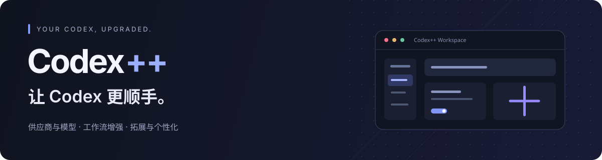
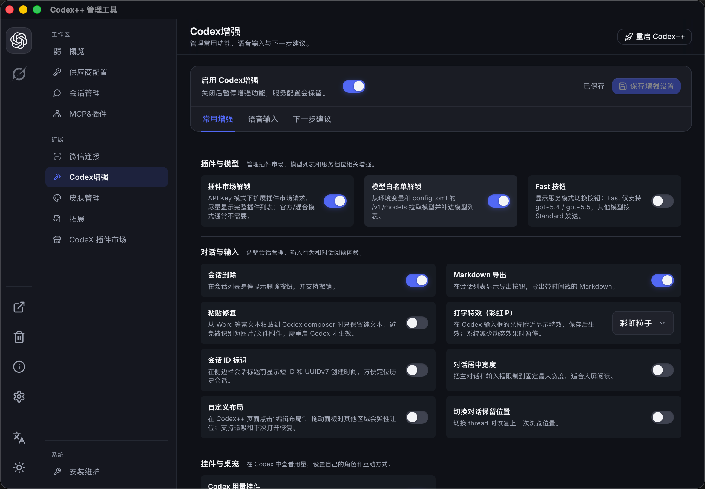
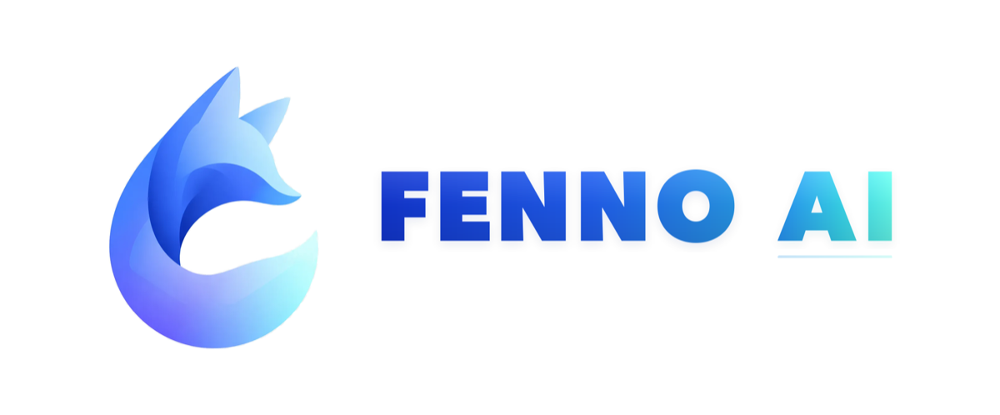
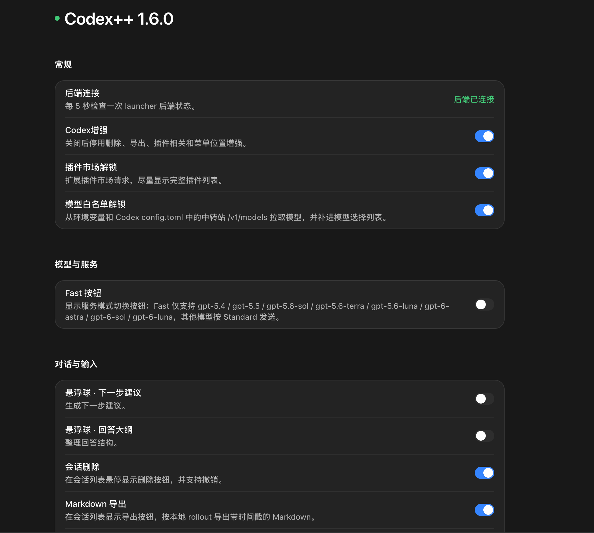
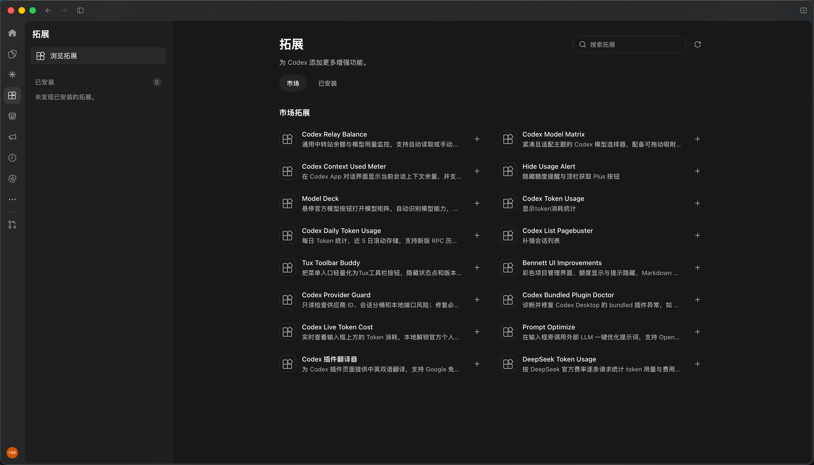
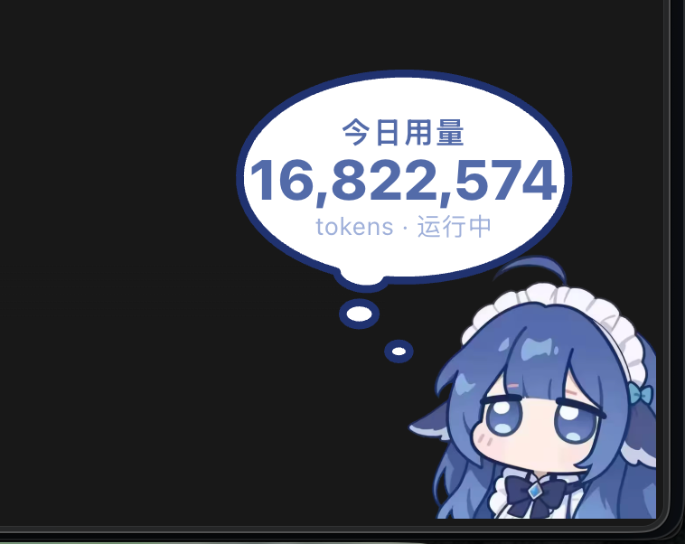
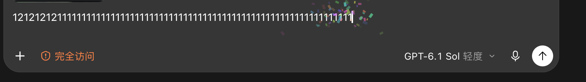

<p align="center">
  
</p>

<p align="center">
  <strong>给 Codex 桌面应用加一点「++」。</strong><br>
  统一管理供应商与模型，让会话更好用，也让工作区更像你。
</p>

<p align="center">
  <a href="https://github.com/BigPizzaV3/CodexPlusPlus/releases"></a>
  <a href="https://github.com/BigPizzaV3/CodexPlusPlus/stargazers"></a>
  <a href="LICENSE"></a>
  
  
</p>

<p align="center">
  <a href="https://github.com/BigPizzaV3/CodexPlusPlus/releases"><strong>下载最新版 ↗</strong></a> &nbsp; · &nbsp;
  <a href="#快速上手">快速上手</a> &nbsp; · &nbsp;
  <a href="#功能一览">功能一览</a> &nbsp; · &nbsp;
  <a href="https://github.com/BigPizzaV3/CodexPlusPlus/issues">反馈问题</a> &nbsp; · &nbsp;
  <a href="README_EN.md">English</a>
</p>

<p align="center">
  
  <br><sub>从供应商配置到界面增强，一个管理工具就够了。</sub>
</p>

Codex++ 是面向 OpenAI Codex / ChatGPT 桌面应用的外部启动器与管理工具，通过 CDP 与本地辅助服务提供供应商切换、协议转换、会话管理和界面增强。它不修改官方应用的 `app.asar`，也不向安装目录写入补丁文件。

## 交流与支持

遇到问题请通过 [GitHub Issues](https://github.com/BigPizzaV3/CodexPlusPlus/issues) 提交，附上系统、Codex++ 版本、复现步骤与已脱敏的日志。欢迎分享拓展、主题和使用经验。

<p align="center">
  <a href="https://qm.qq.com/q/5h3pxpxg7S">QQ 交流 4 群 · 1127858981</a> &nbsp; · &nbsp;
  <a href="https://t.me/CodexPlusPlus">Telegram 频道</a> &nbsp; · &nbsp;
  <a href="https://linux.do">LINUX DO</a>
</p>

## 感谢赞助商

感谢以下赞助商对项目的支持。服务范围、价格与活动以各平台官网说明为准。

<p align="center">
  <a href="https://jojocode.com/">
    
  </a>
</p>

<p align="center">
  <a href="https://jojocode.com/"><strong>JOJO Code</strong></a><br>
  JOJO Code 提供稳定、价格合理的 API 中转服务，支持 GPT-6.1、GPT-6、Fable 5.1、Claude Opus 5.5 等模型与图像能力，适合日常开发、团队协作和长期项目工作流。
</p>

<table>
  <tr>
    <th width="180">🏆 赞助商 🏆</th>
    <th>介绍</th>
  </tr>
  <tr>
    <td align="center">
      <a href="https://jojocode.com/">
        
      </a>
    </td>
    <td><a href="https://jojocode.com/"><strong>JOJO Code</strong></a><br>JOJO Code 提供稳定、价格合理的 API 中转服务，支持 GPT-6.1、GPT-6、Fable 5.1、Claude Opus 5.5 等模型与图像能力，适合日常开发、团队协作和长期项目工作流。</td>
  </tr>
  <tr>
    <td align="center">
      <a href="https://apikey.fun/register?aff=CODEX">
        
      </a>
    </td>
    <td><a href="https://apikey.fun/register?aff=CODEX"><strong>APIKEY.FUN</strong></a><br>感谢 APIKEY.FUN 赞助了本项目！APIKEY.FUN 是一家致力于提供开放、稳定、高性价比的全球主流大模型的 AI 中转站。平台支持 Claude、OpenAI、Gemini 等热门模型的 API 中转服务，价格低至官方原价的 7%。通过专属链接<a href="https://apikey.fun/register?aff=CODEX">注册 APIKEY</a>，可享受最高充值永久 95 折优惠。</td>
  </tr>
  <tr>
    <td align="center">
      <a href="https://grooroute.com/register?aff=2B3KJR5SRNTX">
        
      </a>
    </td>
    <td><a href="https://grooroute.com/register?aff=2B3KJR5SRNTX"><strong>GrooRoute</strong></a><br>GrooRoute 提供 Claude 与 GPT 全系官方原模型，一行配置即可接入 Claude Code、Codex 或直接调用 API，官方承诺不掺假、永久保真。限时注册活动：充值 50 美元赠送 50 美元，通过<a href="https://grooroute.com/register?aff=2B3KJR5SRNTX">专属链接注册</a>并完成充值后，联系客服即可获取优惠。官网：<a href="https://grooroute.com/">grooroute.com</a>。</td>
  </tr>
  <tr>
    <td align="center">
      <a href="https://runapi.host/register?aff=AWJq">
        
      </a>
    </td>
    <td><a href="https://runapi.host/register?aff=AWJq"><strong>RunAPI</strong></a><br>RunAPI 是高效稳定的 API 聚合平台，一个 API Key 即可访问 OpenAI、Claude、Gemini、DeepSeek、Grok 等 150+ 主流模型，低至 1 折，兼容 Claude Code、OpenClaw 等工具。</td>
  </tr>
  <tr>
    <td align="center">
      <a href="https://api.fenno.ai/s/ZZM7">
        
      </a>
    </td>
    <td><a href="https://api.fenno.ai/s/ZZM7"><strong>FennoAI</strong></a><br>FennoAI 是一家稳定、高效的 API 中转服务商，目前主要提供 Codex 中转服务，兼容 OpenAI 及 Anthropic 协议，可灵活接入 Codex、Claude Code、OpenCode 等主流编程工具，稳定支撑千亿 Token/日的企业级调用需求，支持国内及海外主体公对公结算、开票。通过<a href="https://api.fenno.ai/s/ZZM7">专属链接</a>购买订阅，仅需 1.99 美元即可获得价值 50 美元的 Coding Plan 额度；邀请好友购买最高可获得 20% 返佣。</td>
  </tr>
  <tr>
    <td align="center">
      <a href="https://s.qiniu.com/7zUJri">
        
      </a>
    </td>
    <td><a href="https://s.qiniu.com/7zUJri"><strong>七牛云</strong></a><br>感谢七牛云 AI 赞助本项目！七牛云 AI 是七牛云（02567.HK）旗下企业级大模型 MaaS 平台，可一站式调用全球 150 多个主流模型，兼容全球主流模型厂商协议，覆盖文本、图像、音频、视频、文件处理等全模态能力，服务超过 169 万企业及开发者用户。企业用户可免费领取 1200 万 Token，邀请好友最高可获得百亿 Token。</td>
  </tr>
</table>

想支持项目或展示品牌？[联系维护者](mailto:1727532@qq.com)。

## 功能一览

<table>
  <tr>
    <td width="50%" valign="top">
      <h3>🔌 供应商自由切换</h3>
      官方登录、官方登录 + API、纯 API 与聚合供应商。支持 Responses / Chat Completions、模型测试与 Provider Doctor。
    </td>
    <td width="50%" valign="top">
      <h3>🧠 每个模型，各有空间</h3>
      按模型设置上下文窗口与自动压缩阈值，支持模型元数据导入；按供应商选择 MCP、Skill 和 Plugin。
    </td>
  </tr>
  <tr>
    <td valign="top">
      <h3>💬 会话管理更省心</h3>
      本地会话扫描、删除与撤销、批量管理、Markdown 导出、Token 历史、项目移动和线程 ID。
    </td>
    <td valign="top">
      <h3>🧩 拓展你的工作区</h3>
      浏览与管理社区用户脚本，按需添加模型选择、用量统计等能力；另有 MCP、Skill 与 Codex 插件管理。
    </td>
  </tr>
  <tr>
    <td valign="top">
      <h3>✨ 输入与阅读，都顺手</h3>
      语音输入、粘贴修复、会话宽度、滚动位置恢复、下一步建议、回答大纲与光标打字特效。
    </td>
    <td valign="top">
      <h3>🐳 用量可见，也有陪伴 · 开发预览</h3>
      用量挂件、可更换的桌宠角色、任务状态和预算提醒，搭配皮肤与自定义图片，让界面更有自己的风格。
    </td>
  </tr>
</table>

另外，微信连接支持扫码连接本机 Codex，每个联系人映射到独立会话，并可配置允许访问的微信用户。

## 看看它能做什么

### 把常用增强放到手边

在管理工具中集中配置，在 Codex 内直接使用。插件市场与模型列表、会话操作、输入行为和阅读布局，都可以按自己的习惯开关。

<details>
  <summary><strong>展开查看 Codex 内的增强设置</strong></summary>

<p align="center">
  
</p>

</details>

### 让拓展适应你的工作流

从拓展市场发现社区脚本，为工作区添加用量面板、模型选择器、提示词优化等工具。你可以按需安装、启停，也可以编写自己的脚本。

<p align="center">
  
</p>

这里的「拓展」是 Codex++ 用户脚本，与 Codex 官方插件市场是两个入口。社区脚本的服务配置和使用要求以各自说明为准。开发说明见 [用户脚本热重载](docs/user-script-reload.md)。

### 认真工作，也可以有点趣味

<table>
  <tr>
    <td width="42%" valign="top">
      <strong>用量挂件与桌宠 · 开发预览</strong><br>
      查看本地会话 Token 与任务状态，支持拖动、缩放和更换角色图片。
      <p></p>
    </td>
    <td width="58%" valign="top">
      <strong>光标打字特效</strong><br>
      彩虹粒子、烟花与星光，让输入多一点反馈。可随时关闭，系统减少动态效果时暂停。
      <p></p>
    </td>
  </tr>
</table>

用量挂件与桌宠目前处于开发预览阶段，截图来自开发版本；正式发布后的开启方式与统计口径将随版本说明提供。截图中的角色素材归属与使用声明见 [上游素材说明](https://github.com/MeteorNOX/DeepSeek-Balance-Whale-Widget)。

## 快速上手

### 1. 下载适合你的安装包

前往 [GitHub Releases](https://github.com/BigPizzaV3/CodexPlusPlus/releases)，选择对应平台与架构：

| 你的设备 | 安装包 |
| --- | --- |
| Windows · x64 | `CodexPlusPlus-*-windows-x64-setup.exe` |
| macOS · Apple Silicon / Intel | `CodexPlusPlus-*-macos-universal.dmg` |

Codex++ 配合官方桌面应用使用，首次启动前请确认本机已安装对应的 Codex / ChatGPT 应用。

Codex 用量挂件可在「Codex 增强 → 常用增强 → 挂件与桌宠」开启，包含原版角色、模块化泡泡编辑器、音效与波形裁剪、角色/图库/音频资源管理、四边吸附及提醒。查看 Codex 会话与全机用量、订阅快照、配置单价后的本机费用估算，或通过供应商模板接入余额与额度。默认关闭，使用说明与统计口径见 [Codex 用量挂件](docs/whale-widget.md)，功能核对见 [完整功能验收](docs/whale-parity.md)。

**鲸鱼功能来源与鸣谢：**原始功能、完整界面引擎、鲸鱼角色及内置音效/动图来自 [MeteorNOX/DeepSeek-Balance-Whale-Widget](https://github.com/MeteorNOX/DeepSeek-Balance-Whale-Widget)，本项目将其适配为 Codex++ 内置功能；Codex 桌面版技术路线另参考 [Yang-huai406/Codex-Whale-Public](https://github.com/Yang-huai406/Codex-Whale-Public)。原始代码与素材声明见随项目保留的 [LICENSE](assets/inject/upstream/whale-widget/LICENSE) 和 [PROVENANCE.md](assets/inject/upstream/whale-widget/PROVENANCE.md)，素材不重新声明为本项目原创。

### 2. 打开管理工具，完成配置

安装后有两个入口：

| 入口 | 用来做什么 |
| --- | --- |
| **Codex++ 管理工具** | 检查应用路径与运行状态，配置供应商、模型和增强功能，管理更新与诊断。 |
| **Codex++** | 静默启动官方桌面应用，并加载已保存的供应商与增强配置。 |

首次使用先打开 **Codex++ 管理工具**，确认应用路径，再选择供应商模式，按需开启增强功能并保存。

### 3. 从 Codex++ 入口开始工作

从 **Codex++** 启动桌面应用。依赖注入脚本的设置通常需要保存后重启 Codex++ 才会生效。

所有界面增强均可单独关闭；关闭增强总开关后，仍可使用供应商与启动管理能力。后续可在管理工具的「关于」页检查并启动更新。

## 供应商与模型

### 选一种适合你的使用方式

| 模式 | 适用场景 |
| --- | --- |
| **官方登录** | 使用 ChatGPT / Codex 官方账号。 |
| **官方登录 + API** | 保留官方登录状态与插件入口，模型请求始终走配置的兼容 API。 |
| **纯 API** | 使用自定义 Base URL / Key，无需官方账号。 |
| **聚合供应商** | 在多个 API 供应商之间故障转移，或按会话、请求、权重轮转。 |

官方登录 + API 模式下，模型请求不消耗官方额度；它没有「先用官方额度，耗尽再切 API」的行为。Chat Completions 供应商可通过本地代理转换为 Codex 使用的 Responses 协议。

### 给每个模型设置自己的上下文窗口

在模型列表中使用窗口后缀，例如：

```text
deepseek-v4-pro[1M]
your-model[200K]
another-model[128000]
```

支持 `1M`、`200K` 或纯数字。Codex++ 会生成独立的 `model_catalog_json`，让 Codex 按当前模型使用对应窗口；请按实际供应商能力填写。未指定后缀的模型继续使用供应商级上下文配置。

切换供应商时会先保存当前配置，再写入目标配置。API Key 保存在本机，提交反馈前请隐藏密钥与认证信息。

## 常见问题

<details>
  <summary><strong>启动后，为什么没有 Codex++ 菜单？</strong></summary>

确认从 **Codex++** 入口启动。打开管理工具的「安装维护」与「关于」页面，检查应用路径、启动状态和诊断日志。

</details>

<details>
  <summary><strong>切换供应商后，请求为什么失败？</strong></summary>

先在供应商详情中运行模型测试或 Provider Doctor，确认协议、Base URL、Key 与模型匹配。纯 API 和官方登录 + API 使用不同的认证位置，不要手工复制两种模式的 `auth.json`。

</details>

<details>
  <summary><strong>增强功能可以关闭吗？官方应用更新后还能用吗？</strong></summary>

可以分别关闭，也可以关闭增强总开关。Codex++ 依赖官方桌面应用的页面结构、CDP 和本地数据格式；官方应用更新后，部分功能可能需要跟随适配。修改供应商配置或会话数据前，请保留备份。

</details>

<details>
  <summary><strong>配置、会话和日志存在哪里？</strong></summary>

设置了 `CODEX_HOME` 时，Codex 主目录以该变量为准；否则使用 `~/.codex`。

| 数据 | 位置 |
| --- | --- |
| Codex 配置与登录状态 | `~/.codex/config.toml`、`~/.codex/auth.json` |
| 本地数据库 | 优先 `~/.codex/sqlite/*.db`，旧版回退 `~/.codex/state_5.sqlite` |
| Codex++ 状态与日志 | `~/.codex-session-delete/` |
| Provider 同步备份 | `~/.codex/backups_state/provider-sync` |

</details>

## 一起把「++」做得更好

欢迎修复问题、完善文档、开发拓展，或分享你的使用建议。感谢每一位贡献者，也感谢帮助定位问题、测试版本和支持项目的人。

<p align="center">
  <a href="https://github.com/BigPizzaV3/CodexPlusPlus/graphs/contributors">
    
  </a>
  <br><sub>代码贡献者头像由 <a href="https://contrib.rocks">contrib.rocks</a> 生成，点击查看贡献记录。</sub>
</p>

<details>
  <summary><strong>开发与本地检查</strong></summary>

前端位于 `apps/codex-plus-manager`，核心 Rust 库位于 `crates/codex-plus-core`，数据层位于 `crates/codex-plus-data`，界面注入脚本位于 `assets/inject`。

```bash
# 前端检查（先在 apps/codex-plus-manager 安装项目依赖）
cd apps/codex-plus-manager
npm ci
npm run check
npm run vite:build

# Rust 检查（回到仓库根目录）
cd ../..
cargo fmt --all -- --check
cargo test
cargo build --release
```

修改 renderer 注入分片后，运行 `node scripts/assemble-renderer-inject.mjs` 重新组装产物。

</details>

## Star History

如果 Codex++ 对你有帮助，欢迎 [点一颗 Star](https://github.com/BigPizzaV3/CodexPlusPlus)。

<p align="center">
  <a href="https://www.star-history.com/#BigPizzaV3/CodexPlusPlus&amp;Date">
    <picture>
      <source media="(prefers-color-scheme: dark)" srcset="https://api.star-history.com/svg?repos=BigPizzaV3/CodexPlusPlus&amp;type=Date&amp;theme=dark">
      <source media="(prefers-color-scheme: light)" srcset="https://api.star-history.com/svg?repos=BigPizzaV3/CodexPlusPlus&amp;type=Date">
      
    </picture>
  </a>
  <br><sub>曲线由 <a href="https://www.star-history.com">Star History</a> 提供；在线图表与贡献者头像依赖第三方服务加载。</sub>
</p>

---

<p align="center">
  <br>
  <strong>Codex++</strong> · 让 Codex 更顺手。<br>
  <sub>Copyright © 2026 BigPizzaV3 · <a href="LICENSE">AGPL-3.0-only</a></sub>
</p>

CodexPlusPlus 的修改与分发、通过网络提供修改后版本的源代码义务，以 [GNU AGPL v3.0](LICENSE) 为准。许可证覆盖本项目自身代码，第三方素材遵循各自声明；不授予 OpenAI、ChatGPT、Codex 商标或应用资源的权利。
